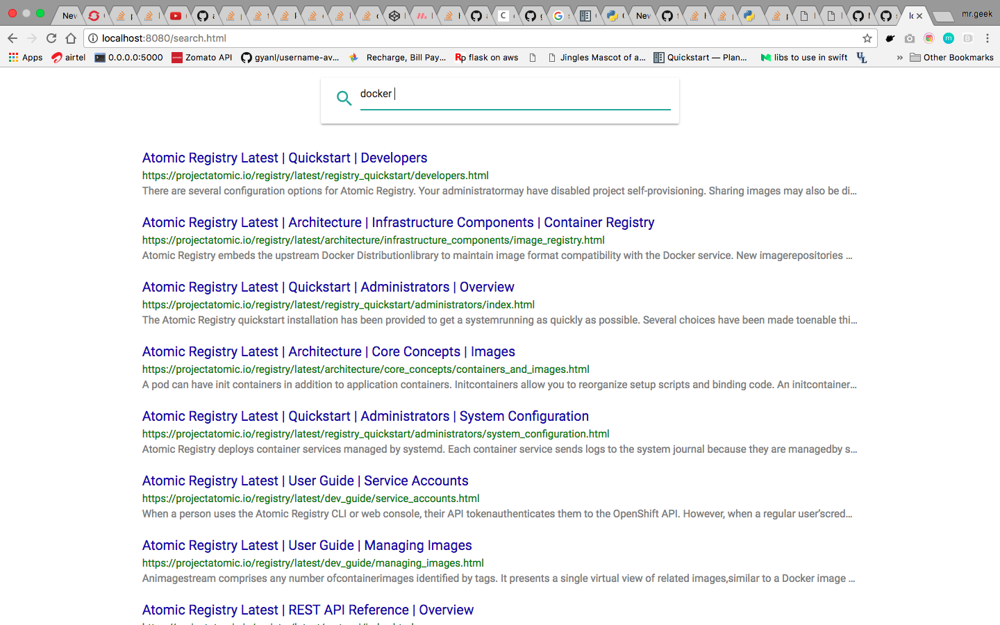

# AsciiBinder Search Plugin  

## What is this?
This is a small plugin that generates a data.json which contains the content and title of each page and puts it in each distro. This file is indexed and searched with search template client side. This plugin provides a default search template that is ready to use, but if you want you can use your own search template. See the instructions below.

## Installation instructions
1. Make sure you have a working installation of python3

1. Create a virtualenv

        python3 -m venv <name of virtualenv>

1. Activate the virtualenv

        source <name of virtualenv>/bin/activate

1. Install

        pip install git+https://github.com/smitthakkar96/ascii_binder_search_plugin

## Usage
1. After your build your site, generate the data.json

        ascii_binder_search

1. Download, and optionally customize, [search.html](https://raw.githubusercontent.com/smitthakkar96/ascii_binder_search_plugin/master/static/search.html)

1. Add the search to the documentation site

        ascii_binder_search -s <filename>

## screenshot

