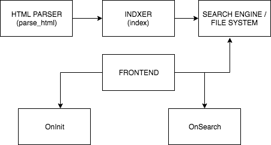

# AsciiBinder Search Plugin  [](https://travis-ci.org/smitthakkar96/ascii_binder_search_plugin)

## What is this?
This is a small plugin developed to help the opensource projects using asciibinder to implement search functionality in their site. With this plugin it is very convenient to implement search functionality in your documentation site. This plugin ships you a indexer that works on client side but it is easy to extend it's capability by plugging in other supported indexer or build your own indexer that works with the search engine that you want. 


## Installation instructions
1. Make sure you have a working installation of python3

1. Create a virtualenv

        python3 -m venv <name of virtualenv>

1. Activate the virtualenv

        source <name of virtualenv>/bin/activate

1. Install

        pip install git+https://github.com/smitthakkar96/ascii_binder_search_plugin


## Usage
1. After successful installation it's time to give this plugin a try, this plugin by default ships a indexer that indexes the data on client side

        ascii_binder_search -i front_end_indexer -v

1. You can install and use different indexers like the one I wrote to use this plugin with elastic. [elastic indexer](github.com/smitthakkar96/absp-elastic)

        ascii_binder_search -i <indexer_name> -v <indexer args>

for indexer args you must checkout the doc that is present with the indexer that you install.

1. Download, and optionally customize [search.html](https://raw.githubusercontent.com/smitthakkar96/ascii_binder_search_plugin/master/static/search.html) or other assets present in
[static directory](https://github.com/smitthakkar96/ascii_binder_search_plugin/static)

        ascii_binder_search -s <path_to_static_directory>

Everything that would be present in static folder will be copied to their respective paths
Please consider using ``` _javascripts/<js_file> ``` for javascripts and ``` _stylesheets/<js_file> ``` for stylesheets in your **search.html**

## How does it work?


## How do I make my own pluggable indexer?
[Check out the boilerplate](https://github.com/smitthakkar96/pluggable_indexer_boilerplate)
